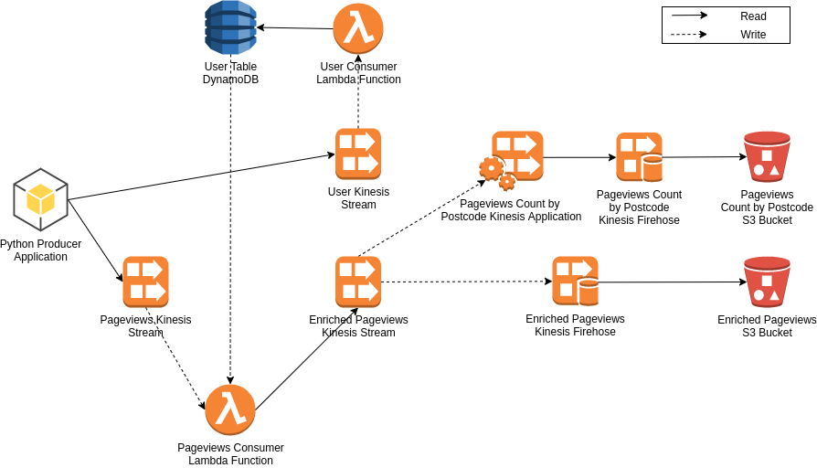

# Realtime Pipeline

This repo contains a realtime pipeline using 3 Kinesis Streams, 1 Kinesis Data Delivery Stream, 1 DynamoDB
and 2 Lambda functions. I've created this mostly as an exercise to get up to speed with terraform.

## Requirements
Please install:
* Python 3.6
* Terraform (instructions to install [here](https://learn.hashicorp.com/terraform/getting-started/install.html))

## How to Deploy
Inside the `prod` directory, run `terraform apply`.

## Generating Events
If you want to generate a few sample events:
* Run `pip install -r requirements.txt`
* Run `python app/producer.py`

## Pipeline
The pipeline is made of the following components:
* Kinesis stream receiving user events. A user event contains pairs of `user_id`, `postcode`.
* Lambda function consuming user events. Each pair `user_id`, `postcode` is stored on a DynamoDB
* Kinesis stream receiving pageview events. A pageview event contains pairs of `user_id`, `url`.
* Lambda function consuming pageview events. Each pair `user_id`, `url` is enriched with the current user's
postcode, which the function gets from the DynamoDB. Enriched records containing `user_id`, `url` and
`postcode` are subsequently published to another Kinesis stream.
* Kinesis stream containing enriched pageviews with triplets `user_id`, `url`, `postcode`.
* Kinesis delivery stream (firehose) writing enriched pageviews into an S3 bucket

## Notes
Not much attention was put into scalability (back-pressure, slow consumers, etc), the main point was to
really focus on the terraform side of things. 
